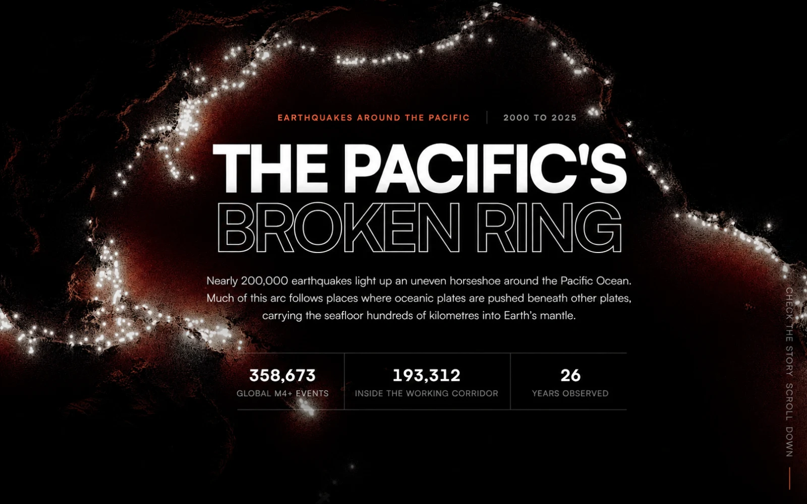
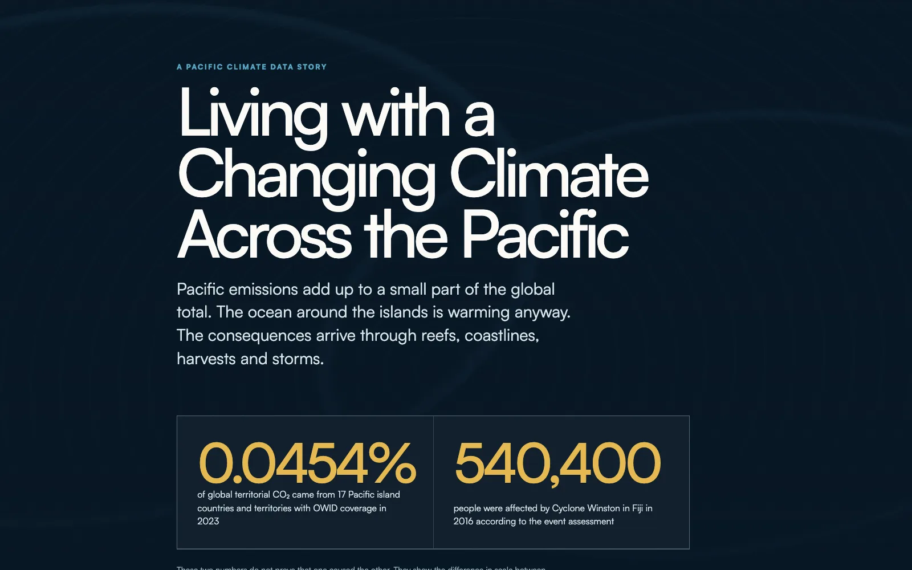
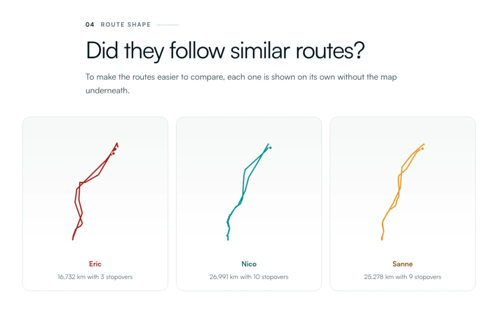

<section class="edp-intro" aria-labelledby="edp-intro-title">

<h2 id="edp-intro-title">A few things I have made <em>with data</em></h2>

Selected data stories

07 projects · 2025–2026

I make these projects to understand things I care about. Climate data helps me grasp what Pacific communities are living through. My Spotify history takes me back to the year I finished my bachelor’s thesis. I always learn something while making them. Maybe one will make you curious too.

Scroll sideways or swipe through the work.

<svg class="edp-intro-flow" viewBox="0 0 320 90" aria-hidden="true" focusable="false">
<path d="M2 63 C52 20 93 78 142 48 S235 19 318 43"></path>
<path d="M2 72 C55 30 98 86 148 57 S240 28 318 51"></path>
<path d="M2 81 C58 40 103 92 154 66 S245 37 318 60"></path>
</svg>

<button class="edp-control" type="button" aria-label="Previous projects" onclick="document.getElementById('edp-project-rail').scrollBy({left:-420})">←</button>
<button class="edp-control" type="button" aria-label="Next projects" onclick="document.getElementById('edp-project-rail').scrollBy({left:420})">→</button>

</section>
<section class="edp-showcase" id="selected-work" aria-label="Selected work">

<article class="edp-card">

<time class="edp-meta" datetime="2026">2026</time>
Earth science · Visual essay

<a class="edp-card-visual" href="https://danilyanedo7.github.io/ring_of_fire/" target="_blank" rel="noopener noreferrer" aria-label="Explore The Pacific's broken ring">
<picture>
<source media="(max-width:720px)" srcset="ring-of-fire-900.webp">

</picture>
</a>
<h3>The ring of fire</h3>

What do 358,673 earthquakes reveal about the shape, depth, and pulse of the Ring of Fire?

An interactive visual essay about the uneven horseshoe of earthquakes around the Pacific, the tectonic processes beneath it, and the limits of drawing a single Ring of Fire boundary.

R · D3 · Quarto

<a class="edp-link" href="https://danilyanedo7.github.io/ring_of_fire/" target="_blank" rel="noopener noreferrer">Explore the full story</a>

</article>
<article class="edp-card">

<time class="edp-meta" datetime="2026">2026</time>
Climate · Interactive story

<a class="edp-card-visual" href="https://danilyanedo7.github.io/pacific_dataviz_challenge/" target="_blank" rel="noopener noreferrer" aria-label="Explore Living with a Changing Climate Across the Pacific">
<picture>
<source media="(max-width:720px)" srcset="pacific-900.webp">

</picture>
</a>
<h3>Living with a changing climate across the Pacific</h3>

How does climate exposure look when a region’s contribution is measured at global scale?

A careful journey through emissions, ocean warming, cyclones, reef heat stress, rainfall, sea level, disasters, and the changing electricity mix across the Pacific.

R · D3 · JavaScript · Quarto

<a class="edp-link" href="https://danilyanedo7.github.io/pacific_dataviz_challenge/" target="_blank" rel="noopener noreferrer">Explore the climate story</a>

</article>
<article class="edp-card">

<time class="edp-meta" datetime="2026">2026</time>
Movement · Visual essay

<a class="edp-card-visual" href="https://danilyanedo7.github.io/bird_migration/" target="_blank" rel="noopener noreferrer" aria-label="Explore Bird migration">
<picture>
<source media="(max-width:720px)" srcset="bird-900.webp">

</picture>
</a>
<h3>Bird migration</h3>

How did three gulls from the same coast find different ways south?

Three gulls from the same coast left up to 78 days apart and wintered in different countries. Their journeys show how timing and stopovers can split a shared migration route.

JavaScript · SVG · Interactive map

<a class="edp-link" href="https://danilyanedo7.github.io/bird_migration/" target="_blank" rel="noopener noreferrer">Follow the journeys</a>

</article>
<article class="edp-card">

<time class="edp-meta" datetime="2025">2025</time>
Geospatial · Visual essay

<a class="edp-card-visual" href="https://danilyanedo7.github.io/living_with_volcano/" target="_blank" rel="noopener noreferrer" aria-label="Explore Living with volcano">
<picture>
<source media="(max-width:720px)" srcset="volcano-900.webp">

</picture>
</a>
<h3>Living with volcano</h3>

How close do millions of people actually live to an active volcano?

About 60 million people live within 30 kilometres of a Holocene volcano on Java. The number shows the scale of exposure, while distance alone cannot describe volcanic risk.

R · Leaflet · Rayshader · Quarto

<a class="edp-link" href="https://danilyanedo7.github.io/living_with_volcano/" target="_blank" rel="noopener noreferrer">Explore the full story</a>

</article>
<article class="edp-card">

<time class="edp-meta" datetime="2026">2026</time>
Microbiology · Data story

<a class="edp-card-visual" href="https://danilyanedo7.github.io/steady_state/" target="_blank" rel="noopener noreferrer" aria-label="Explore Growing, but not yet steady">
<picture>
<source media="(max-width:720px)" srcset="steady-900.webp">

</picture>
</a>
<h3>Growing, but not yet steady</h3>

When does a growing microbial population actually become steady?

At a 1 to 10,000 dilution, effective steady state lasted about 90 minutes, while a 1 to 100 culture never reached it. The result shows why cloudiness alone can make a changing population appear steady.

R · JavaScript · Quarto

<a class="edp-link" href="https://danilyanedo7.github.io/steady_state/" target="_blank" rel="noopener noreferrer">Explore the full story</a>

</article>
<article class="edp-card">

<time class="edp-meta" datetime="2026">2026</time>
Personal data · Visual essay

<a class="edp-card-visual" href="https://danilyanedo7.github.io/spotify_redesign/" target="_blank" rel="noopener noreferrer" aria-label="Explore My year in music">
<picture>
<source media="(max-width:720px)" srcset="spotify-900.webp">

</picture>
</a>
<h3>My year in music</h3>

What can a year of listening history remember that I forgot?

My listening reached 187.7 hours in July, more than twice the spring average, then eased after I moved to Poland. The pattern turns a year of Spotify history into a record of thesis pressure and changing routines.

R · JavaScript · Quarto

<a class="edp-link" href="https://danilyanedo7.github.io/spotify_redesign/" target="_blank" rel="noopener noreferrer">Explore the full story</a>

</article>
<article class="edp-card">

<time class="edp-meta" datetime="2026">2026</time>
Food · Network story

<a class="edp-card-visual" href="https://danilyanedo7.github.io/soto-one-soup-many-islands/" target="_blank" rel="noopener noreferrer" aria-label="Explore One soup, many islands">
<picture>
<source media="(max-width:720px)" srcset="soto-900.webp">

</picture>
</a>
<h3>One soup, many islands</h3>

How can one dish keep the same name while changing from island to island?

Soto Kebumen and Soto Seger Boyolali share eleven recorded ingredients and differ only by galangal. Their similarity shows that names and geography do not always predict how a bowl is made.

D3 · JavaScript · Quarto

<a class="edp-link" href="https://danilyanedo7.github.io/soto-one-soup-many-islands/" target="_blank" rel="noopener noreferrer">Explore the full story</a>

</article>

</section>
<section class="edp-earlier" aria-labelledby="edp-earlier-title">

From the archive

<h2 id="edp-earlier-title">More experiments</h2>

Smaller and earlier projects that trace how my interests in spatial analysis, R, dashboards, and teaching have developed.

<a href="/post/coastal-vulnerability/">2025Where is Gresik’s coast most vulnerable?Spatial investigation</a>
<a href="https://danilyanedo7.github.io/30dayschartchallenge/" target="_blank" rel="noopener noreferrer">202330 day chart challengeVisualisation tutorials</a>
<a href="/project/shinyapp/">2024Species distribution mapperR Shiny experiment</a>
<a href="/post/dashboard_collection/">2023Dashboard collectionInteractive archive</a>
<a href="https://danilyanedo7.github.io/kaggle-energy/" target="_blank" rel="noopener noreferrer">2026Spain’s power gridEnergy dashboard</a>

</section>

