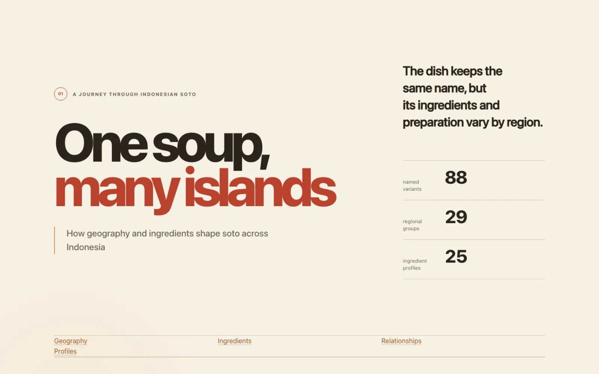
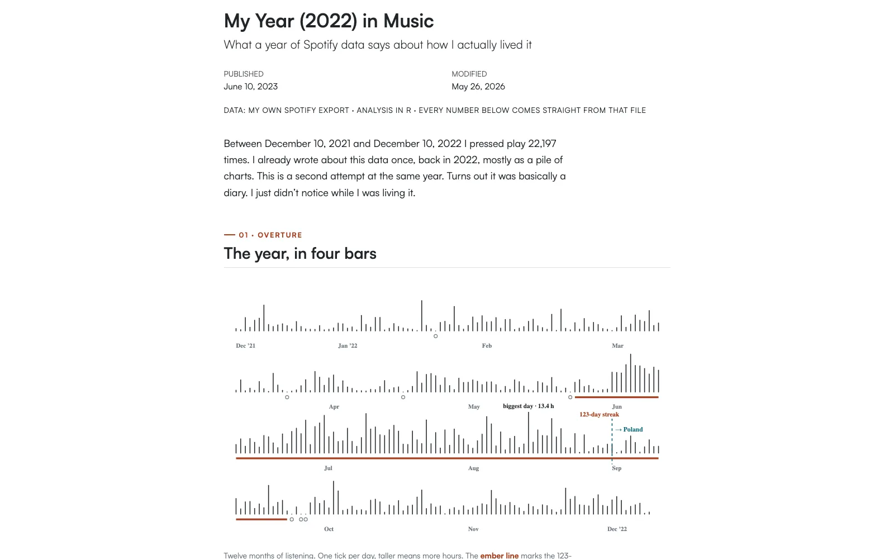
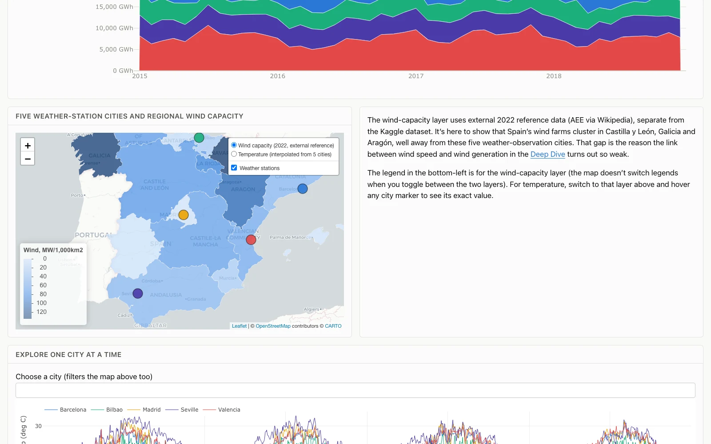
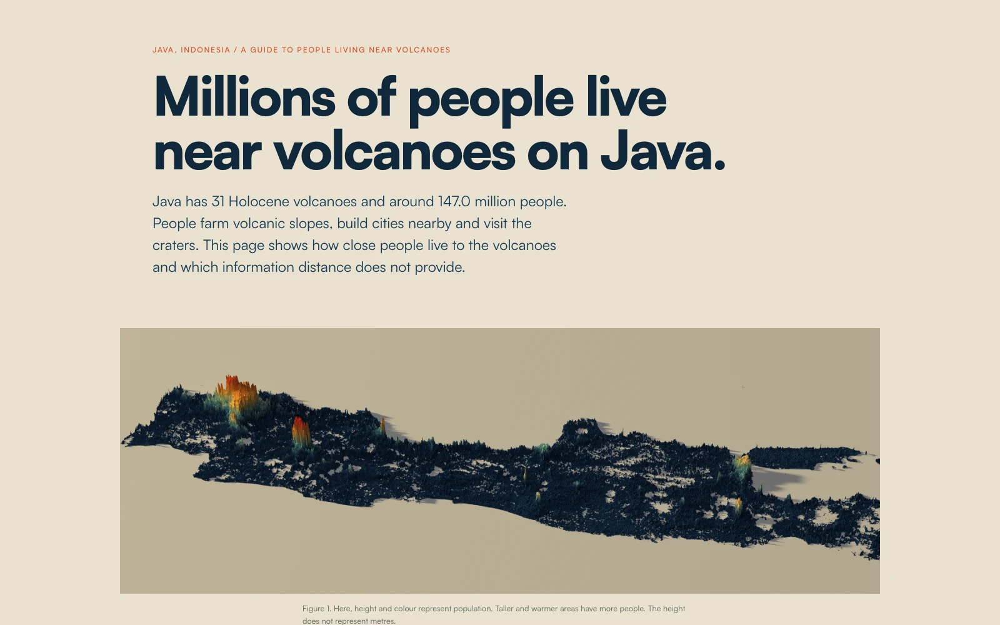
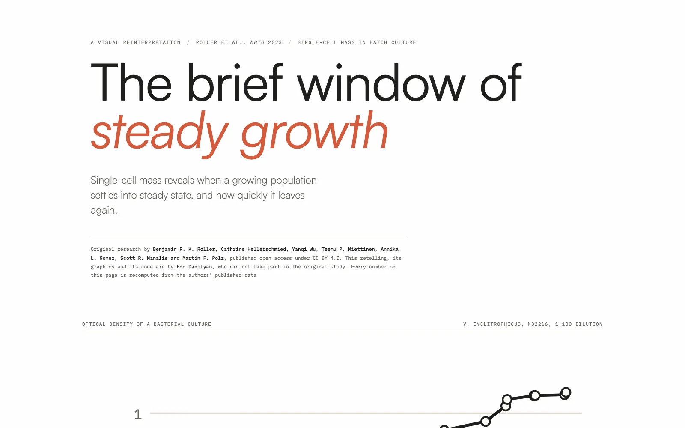

<section class="edp-intro" aria-labelledby="edp-intro-title">

Selected work

<h2 id="edp-intro-title">Questions I followed further than expected</h2>

A few complete investigations into food, music, energy, and the patterns hiding in ordinary data

<a class="edp-link" href="#featured-work">See the stories ↓</a>

</section>
<main id="featured-work" aria-label="Featured work">
<article class="edp-case">
<a class="edp-visual" href="https://danilyanedo7.github.io/soto-one-soup-many-islands/" target="_blank" rel="noopener noreferrer" aria-label="Explore One Soup, Many Islands">
<picture>
<source media="(max-width:720px)" srcset="soto-900.webp">

</picture>
</a>

01 / Food and geography

<h2>One Soup, Many Islands</h2>

How can one dish keep the same name while changing from island to island?

I mapped 88 named soto variants, then compared 25 documented ingredient profiles. Most bowls begin with the same aromatic base, but the less common ingredients reveal regional character and some surprising relatives across islands.

D3 · JavaScript · Quarto

<a class="edp-link" href="https://danilyanedo7.github.io/soto-one-soup-many-islands/" target="_blank" rel="noopener noreferrer">Explore the full story ↗</a>

</article>
<article class="edp-case edp-case-reverse">
<a class="edp-visual" href="https://danilyanedo7.github.io/spotify_redesign/" target="_blank" rel="noopener noreferrer" aria-label="Explore A Year in 22,197 Plays">
<picture>
<source media="(max-width:720px)" srcset="spotify-900.webp">

</picture>
</a>

02 / Personal data

<h2>A Year in 22,197 Plays</h2>

What does a year of Spotify history remember that I forgot?

I revisited my 2022 export as a diary instead of a pile of charts. The timeline traces a 123-day listening streak through my thesis, seven silent days, and the change in rhythm when I moved from Surabaya to Poland.

R · JavaScript · Quarto

<a class="edp-link" href="https://danilyanedo7.github.io/spotify_redesign/" target="_blank" rel="noopener noreferrer">Explore the full story ↗</a>

</article>
<article class="edp-case">
<a class="edp-visual" href="https://danilyanedo7.github.io/kaggle-energy/" target="_blank" rel="noopener noreferrer" aria-label="Explore Spain's Power Grid">
<picture>
<source media="(max-width:720px)" srcset="spain-900.webp">

</picture>
</a>

03 / Energy systems

<h2>Spain’s Power Grid</h2>

What happens to the grid when renewable supply changes?

I explored hourly demand, generation, prices, and weather from 2015 to 2018. The dashboard follows the generation mix and digs into 2017, when drought reduced hydro generation and fossil sources stepped in as backup.

R · Plotly · Leaflet · Quarto

<a class="edp-link" href="https://danilyanedo7.github.io/kaggle-energy/" target="_blank" rel="noopener noreferrer">Explore the dashboard ↗</a>

</article>
<article class="edp-case edp-case-reverse">
<a class="edp-visual" href="https://danilyanedo7.github.io/living_with_volcano/" target="_blank" rel="noopener noreferrer" aria-label="Explore Living With Volcanoes">
<picture>
<source media="(max-width:720px)" srcset="volcano-900.webp">

</picture>
</a>

04 / Population and geography

<h2>Living With Volcanoes</h2>

How close do millions of people actually live to an active volcano?

I wanted to know how many people in Java live close to a volcano, so I mapped all 31 Holocene volcanoes against population data. Of the island’s 147 million residents, around 60 million live within 30 km of at least one volcano. Nearly 8.8 million live within 30 km of Tangkuban Parahu alone. Those numbers sound alarming, but this is a map of proximity. Living close to a volcano does not automatically mean being in danger, and the official data still left some questions unanswered.

R · Leaflet · Rayshader · Quarto

<a class="edp-link" href="https://danilyanedo7.github.io/living_with_volcano/" target="_blank" rel="noopener noreferrer">Explore the full story ↗</a>

</article>
<article class="edp-case">
<a class="edp-visual" href="https://danilyanedo7.github.io/steady_state/" target="_blank" rel="noopener noreferrer" aria-label="Explore The Brief Window of Steady Growth">
<picture>
<source media="(max-width:720px)" srcset="steady-900.webp">

</picture>
</a>

05 / Cell biology

<h2>The Brief Window of Steady Growth</h2>

Does a smoothly rising growth curve prove a culture has reached steady state?

Using Roller et al.’s 2023 single-cell mass data, I built a visual data story that traces how median cell mass climbs tenfold, from 47 to 492 femtograms, before a culture actually settles into steady state. That window lasts about 90 minutes under the best conditions, and most of the growth inside it comes from cells gaining mass rather than dividing, a distinction optical density alone can’t show.

R · JavaScript · Quarto

<a class="edp-link" href="https://danilyanedo7.github.io/steady_state/" target="_blank" rel="noopener noreferrer">Explore the full story ↗</a>

</article>
</main>
<section class="edp-earlier" aria-labelledby="edp-earlier-title">

From the archive

<h2 id="edp-earlier-title">Earlier work and experiments</h2>

Smaller things I made while learning, teaching, or following a useful detour.

<a href="/post/coastal-vulnerability/">Where Is Gresik’s Coast Most Vulnerable?Spatial investigation→</a>
<a href="https://danilyanedo7.github.io/30dayschartchallenge/" target="_blank" rel="noopener noreferrer">30 Day Chart ChallengeVisualisation tutorials↗</a>
<a href="/project/shinyapp/">Species Distribution MapperR Shiny experiment→</a>
<a href="/post/dashboard_collection/">Dashboard CollectionInteractive archive→</a>

</section>

